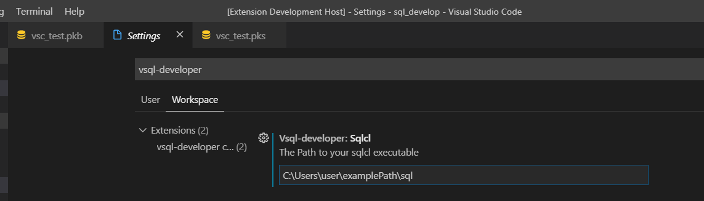

# VSQL-Developer
An Visual Studio Code Extension for compiling (PL)SQL code with SQLcl inside VScode

## Getting Started
There are three ways to get this extension running in your VScode
The easiest way is to just install it from the VScode marketplace.(link)
But you can also dwonload an installable file from (link).
If you want to adjust or expand the extension yourself you can follow the installing instructions .

No matter which way you choose, after you have installed the extension you have to do a quick setup.

### Prerequisites

Needed:
To install the extension you obviously need VisualStudio Code (developed with version 1.40.1 but may also work fine with other versions )
You will also need SQLcl which is used to compile the code

Get VsCode here: (link)
Get SQLcl here: (link)

Recommended:
plsql extension

get plsql extension(link)

### Installing

A step by step series of examples that tell you how to get a development env running

Say what the step will be

```
Give the example
```

And repeat

```
until finished
```

End with an example of getting some data out of the system or using it for a little demo

### Setup
After you have successfully installed the extension you need to follow some setup steps to get it working

At first you need to add the path of your your sqlcl installation

```
To do so press 'ctrl + shift + p', type in "settings" and choose "Preferences: Open Settings(UI)".
```

```
Then search for "vsql-deveolper" and add the Path to your SQLcl installation.
```

Note: It may only work after you have restartet Visual Studio code.


The second Step is to add you peronal Database connectionstrings
```
For this you have to create a file named "database_connectionStrings.json" in the root folder of your project.
Now you can add somme connection strings to your databases like shown in the image below.
```

Just safe the file. The extension will automatically recognize it.

Now you are ready to use vsql-developer

```
For that just click on the file containing sql or plsql code which you want to execute.
Then press 'ctrl + shift + p' and choose "Compile PLSQL".
```
Feel free to add a key to the "Compile PLSQL"-command(link).

## Running the tests


## Authors

* **Sebastian Koell** - *Project Owner and Idea* -
* **fd-primus** - *Development* - 


See also the list of [contributors](https://github.com/your/project/contributors) who participated in this project.

## License

This project is licensed under the MIT License - see the [LICENSE.md](LICENSE.md) file for details

## Acknowledgments
### Thanks to
*  ... whos guidline and error file i used (link).
*  Creator of odb-task for some inspiration (link).
*  for the readme template (link).
