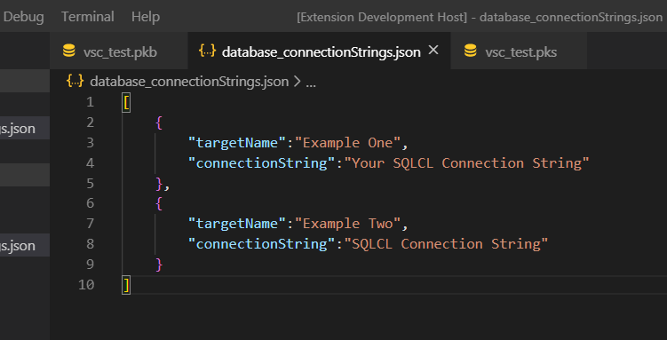

# vsql-developer README

This extension provides functionallity to execute and compile (PL)SQL code on an oracle Database with SQLcl.

## Features
* executing and compiling (PL)SQL code
* problems will be shown in the terminal
* you can add multiple databases

## Requirements

**Required:**  
* **SQLcl** which is used to compile the code
  
Get SQLcl [here](https://www.oracle.com/de/database/technologies/appdev/sqlcl.html)

**Recommended:**  
* [Language PL/SQL](https://marketplace.visualstudio.com/items?itemName=xyz.plsql-language)  
* [Bracket Pair Colorizer 2](https://marketplace.visualstudio.com/items?itemName=CoenraadS.bracket-pair-colorizer-2)  
* [Material Icon Theme](https://marketplace.visualstudio.com/items?itemName=PKief.material-icon-theme)

## Setup
After you have successfully installed the extension you need to follow some setup steps to get it working.

### At first you need to add the path of your sqlcl installation:

```
To do so press 'ctrl + shift + p', type in "settings" and choose "Preferences: Open Settings(UI)".
```
 for full documentation](readme-iages/settings.png)
```
Then search for "vsql-developer" and add the path of your SQLcl installation.
```
](readme-images/sqlclPath.png)
Note: It may only work after you have restarted Visual Studio code.


### The second step is, to add your personal database connection strings:
```
For this you have to create a file named "database_connectionStrings.json" in  
the root folder of your project.
Now you can add some connections like shown in the image below.
```


Note: Just save the file. The extension will automatically recognize it.

Now you are ready to use vsql-developer!

```
For this just click on the file containing the (PL)SQL code that you want to execute.
Then press 'ctrl + shift + p' and choose "Compile PLSQL".
```
Feel free to [add a key](https://code.visualstudio.com/docs/getstarted/keybindings) to the "Compile PLSQL"-command.

## Extension Settings

* `vsql-developer.sqlcl`: set the path to your SQLcl installation

## Known Issues

For now the database connection builds up every time you call CompilePLSQL command.
To get a permanent connection we are currently working on a version which adjusts the terminal to stay connected in SQLcl until you exit or change the database.

## Release Notes

### 1.0.0

Initial release of VSQL-Developer

## Acknowledgments
### Thanks to
*  Morten Braten whose [guide](https://ora-00001.blogspot.com/2017/03/using-vs-code-for-plsql-development.html) and error file I used
*  Trent Schafer [odb-task extension](https://marketplace.visualstudio.com/items?itemName=tschf.odb-task) for some inspiration
-----------------------------------------------------------------------------------------------------------